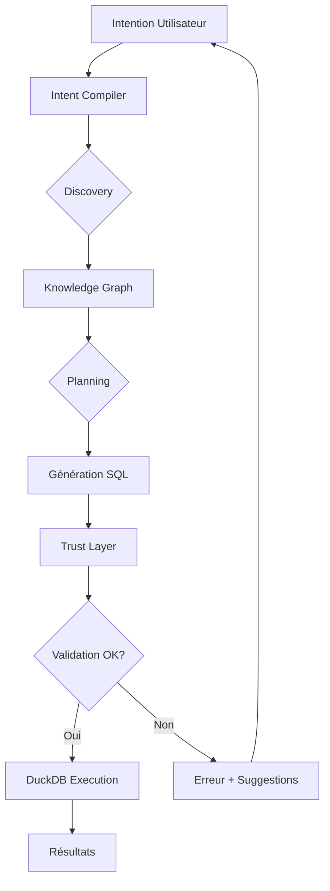

# 🎯 ADOS - Guide de Démarrage Complet

## 📋 Récapitulatif du Projet

Vous avez maintenant un **prototype fonctionnel d'AI-Native Data Operating System** basé sur une architecture 100% Open Source qui transforme des intentions en langage naturel en plans d'exécution de données.

---

## 📁 Structure Complète du Projet

```
ADOS/
│
├── 📜 Fichiers de Configuration
│   ├── requirements.txt          # Dépendances Python
│   ├── .env.example              # Template configuration API
│   ├── .gitignore                # Fichiers à ignorer
│   └── .chainlit/
│       └── config.toml           # Configuration Chainlit
│
├── 🚀 Scripts Principaux
│   ├── ados_main.py              # Script CLI principal (⭐ POINT D'ENTRÉE)
│   ├── ados_interface.py         # Interface Web Chainlit
│   ├── test_ados.py              # Suite de tests complète
│   ├── start.bat                 # Launcher Windows
│   └── start.sh                  # Launcher Linux/Mac
│
├── 🧩 Modules Core
│   └── modules/
│       ├── __init__.py
│       ├── data_generator.py    # ✅ Génération Data Products
│       ├── knowledge_graph.py   # ✅ Living Knowledge Graph
│       ├── intent_compiler.py   # ✅ Compilateur LangGraph
│       └── trust_layer.py       # ✅ Validation & Audit
│
├── 📊 Données Générées
│   └── data/                    # Créé automatiquement
│       ├── customer_domain.parquet
│       ├── logistics_domain.parquet
│       └── sales_domain.parquet
│
└── 📚 Documentation
    ├── README.md                # Vue d'ensemble
    ├── QUICKSTART.md            # Installation 5 min
    ├── ARCHITECTURE.md          # Documentation technique
    ├── EXAMPLES.md              # 15+ cas d'usage
    ├── CHANGELOG.md             # Historique des versions
    └── SUMMARY.md               # Ce fichier
```

**Total : 23 fichiers créés**

---

## 🎬 Démarrage en 3 Étapes

### Étape 1 : Installation (5 minutes)

#### Windows
```bash
# Double-cliquer sur start.bat
# OU en ligne de commande :
start.bat
```

#### Linux/Mac
```bash
chmod +x start.sh
./start.sh
```

Le script va :
1. ✅ Vérifier Python
2. ✅ Créer l'environnement virtuel
3. ✅ Installer les dépendances
4. ✅ Créer le fichier .env

### Étape 2 : Configuration

Éditez le fichier `.env` :

```bash
# Remplacez par votre vraie clé API
OPENAI_API_KEY=sk-votre-clé-ici

# Optionnel : changer le modèle
OPENAI_MODEL=gpt-3.5-turbo  # Plus rapide et moins cher
```

**Obtenir une clé API** : https://platform.openai.com/api-keys

### Étape 3 : Lancement

Choisissez votre interface :

#### Option A : CLI (Terminal)
```bash
python ados_main.py
```

#### Option B : Web (Navigateur)
```bash
chainlit run ados_interface.py
```

#### Option C : Mode Demo
```bash
python ados_main.py --demo
```

---

## 🧪 Vérification de l'Installation

Exécutez la suite de tests :

```bash
python test_ados.py
```

**Résultat attendu :**
```
🧪 ADOS - Suite de Tests Complète

TEST 1: Vérification des Imports
✓ pandas installé
✓ numpy installé
✓ faker installé
✓ duckdb installé
✓ networkx installé
✓ langchain installé
✓ langgraph installé

[...autres tests...]

Score: 6/6 tests réussis
🎉 Tous les tests sont passés ! Le système est prêt.
```

---

## 📖 Exemples de Requêtes

Une fois lancé, essayez ces requêtes :

### Niveau Débutant
```
Montre-moi tous les clients
Combien de produits avons-nous ?
Liste les 20 dernières transactions
```

### Niveau Intermédiaire
```
Top 10 clients par montant total
Produits avec un stock inférieur à 50
Clients avec un score de fidélité > 80
```

### Niveau Avancé
```
Analyse l'impact des stocks bas sur mes clients VIP
Compare les performances par région avec les délais de livraison
Identifie les clients fidèles qui n'ont pas acheté depuis 3 mois
```

---

## 🏗️ Architecture - Vue d'Ensemble

```
USER → Interface (CLI/Web)
         ↓
      INTENT COMPILER (LangGraph)
         ├─→ Discovery Node  → Knowledge Graph
         ├─→ Planning Node   → SQL Generation
         └─→ Execution Node  → DuckDB
                ↓
         TRUST LAYER (Validation)
                ↓
         RESULTS (JSON/DataFrame)
```

### Flux Détaillé



---

## 🔧 Composants Détaillés

### 1. Data Mesh Simulator
- **Fichier** : `modules/data_generator.py`
- **Rôle** : Génère 3 Data Products simulant un Data Mesh
- **Output** : Fichiers Parquet avec relations cohérentes

**Test indépendant :**
```bash
python -m modules.data_generator
```

### 2. Living Knowledge Graph
- **Fichier** : `modules/knowledge_graph.py`
- **Rôle** : Découvre automatiquement les relations entre colonnes
- **Technologie** : NetworkX (in-memory) ou Neo4j (optionnel)

**Test indépendant :**
```bash
python -m modules.knowledge_graph
```

### 3. Intent Compiler (LangGraph)
- **Fichier** : `modules/intent_compiler.py`
- **Rôle** : Orchestre le workflow Discovery → Planning → Execution
- **Technologie** : LangGraph + LangChain + OpenAI

**Workflow :**
1. **Discovery** : LLM identifie les fichiers/colonnes nécessaires
2. **Planning** : Génère la requête SQL DuckDB optimale
3. **Execution** : Matérialise et exécute la vue

### 4. Trust Layer
- **Fichier** : `modules/trust_layer.py`
- **Rôle** : Valide et audite chaque plan d'exécution
- **Règles** : 6 catégories de validation (fichiers, colonnes, types, sécurité)

**Test indépendant :**
```bash
python -m modules.trust_layer
```

---

## 📊 Cas d'Usage Métier

### 1. Analyse Client
```
"Identifie mes clients VIP avec leurs achats totaux"
→ Segmentation automatique + agrégation
```

### 2. Optimisation Logistique
```
"Produits en rupture de stock avec impact sur les ventes"
→ Jointure Customer-Sales-Logistics
```

### 3. Analyse Régionale
```
"Performance des ventes par région avec délais moyens"
→ Agrégations multi-domaines
```

---

## 🚀 Extensions Possibles

### Facile (< 1 jour)
- [ ] Ajouter un Data Product (module `data_generator.py`)
- [ ] Nouvelle règle de validation (module `trust_layer.py`)
- [ ] Exporter résultats en CSV/Excel

### Moyen (2-3 jours)
- [ ] Intégrer Neo4j pour graphe persistant
- [ ] API REST avec FastAPI
- [ ] Dashboard Streamlit personnalisé

### Avancé (1 semaine)
- [ ] Connexion à base de données réelle (PostgreSQL)
- [ ] Cache Redis pour résultats LLM
- [ ] Mode offline avec modèles locaux (Llama, Mistral)

---

## 🐛 Dépannage

### Problème : "OPENAI_API_KEY non définie"
**Solution :** Créez un fichier `.env` avec votre clé API

### Problème : "Module not found"
**Solution :** Réinstallez les dépendances
```bash
pip install -r requirements.txt
```

### Problème : "Aucun fichier Parquet trouvé"
**Solution :** Le système les génère automatiquement. Relancez :
```bash
python -m modules.data_generator
```

### Problème : "Requête trop lente"
**Solution :** Utilisez `gpt-3.5-turbo` dans `.env` au lieu de `gpt-4`

---

## 📚 Documentation Complète

| Fichier | Description |
|---------|-------------|
| [README.md](README.md) | Vue d'ensemble du projet |
| [QUICKSTART.md](QUICKSTART.md) | Installation en 5 minutes |
| [ARCHITECTURE.md](ARCHITECTURE.md) | Documentation technique détaillée |
| [EXAMPLES.md](EXAMPLES.md) | 15+ exemples et cas d'usage |
| [CHANGELOG.md](CHANGELOG.md) | Historique des versions |

---

## 🎯 Checklist de Validation

Avant de considérer le projet comme opérationnel :

- [x] ✅ Tous les fichiers créés (23 fichiers)
- [ ] ⏳ Environnement virtuel activé
- [ ] ⏳ Dépendances installées
- [ ] ⏳ Fichier `.env` configuré avec clé API
- [ ] ⏳ Tests exécutés avec succès (`test_ados.py`)
- [ ] ⏳ Données générées dans `data/`
- [ ] ⏳ Première requête testée
- [ ] ⏳ Interface Web lancée

---

## 🎓 Prochaines Étapes Recommandées

### Pour Apprendre
1. Exécutez `python test_ados.py` pour comprendre chaque composant
2. Testez chaque module indépendamment
3. Lisez [ARCHITECTURE.md](ARCHITECTURE.md) pour la vision technique

### Pour Expérimenter
1. Lancez le mode démo : `python ados_main.py --demo`
2. Essayez vos propres requêtes
3. Consultez [EXAMPLES.md](EXAMPLES.md) pour inspiration

### Pour Développer
1. Ajoutez un nouveau Data Product
2. Créez une règle de validation personnalisée
3. Intégrez avec votre propre source de données

---

## 🏆 Félicitations !

Vous disposez maintenant d'un **prototype fonctionnel** d'un système autonome de gestion de données piloté par l'IA. 

**Ce qu'il fait :**
- ✅ Génère des données synthétiques cohérentes
- ✅ Découvre automatiquement les relations sémantiques
- ✅ Transforme le langage naturel en SQL
- ✅ Valide la sécurité et la cohérence
- ✅ Exécute et matérialise les résultats

**Architecture 100% Open Source :**
- LangGraph (orchestration)
- DuckDB (analytics)
- NetworkX (graphe)
- Faker + Pandas (données)
- Chainlit (interface)

---

## 📞 Support

**Questions ?** Consultez d'abord :
1. [QUICKSTART.md](QUICKSTART.md) - Installation
2. [EXAMPLES.md](EXAMPLES.md) - Cas d'usage
3. [ARCHITECTURE.md](ARCHITECTURE.md) - Détails techniques

**Bug trouvé ?**
- Vérifiez les logs dans `ados.log`
- Relancez les tests : `python test_ados.py`

---

## 📖 License

Ce projet est un prototype éducatif. Adaptez et étendez selon vos besoins.

---

**Bon Data Operating ! 🚀**
